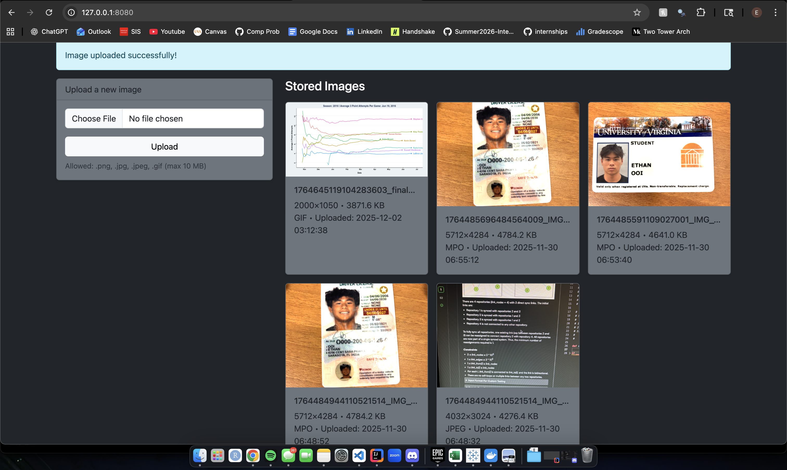
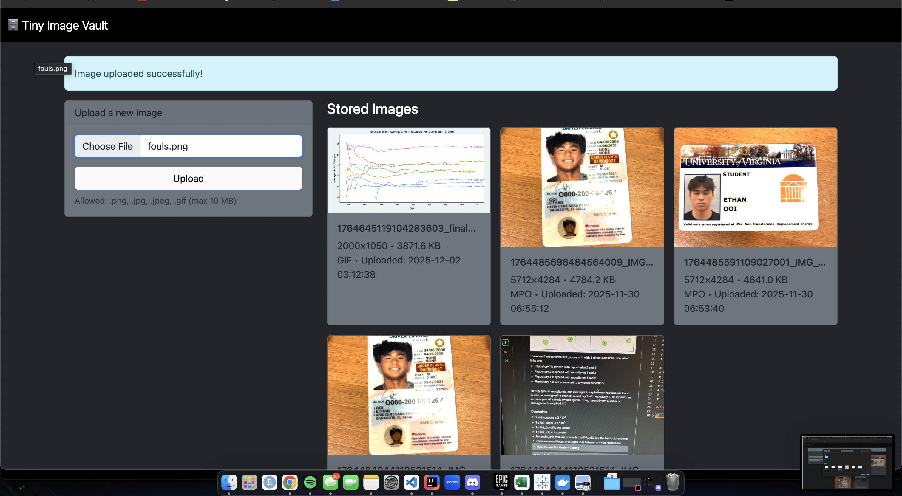
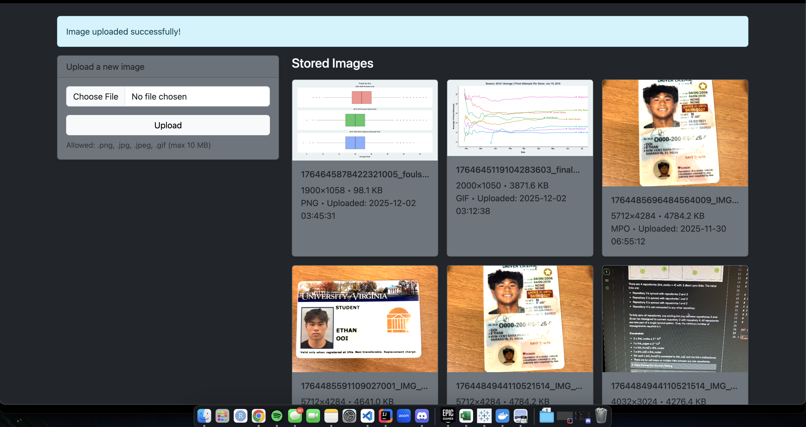

# Ethan Ooi | Systems Final Write-Up

## 1) Executive Summary
Problem: People often need an easy, accessiblw way to upload, store, and keep track of important images on their device. Whether this is for small projects, important documents, or other applications, there's always a need to organize and store personal images.
Solution: This project provides a user-friendly image storage system that runs entirely through a Docker container. Through a simple web interface, a user can upload any .png, .jpg, .jpeg, or .gif file. The system requires no external devices and can be deployed with a single simple command.

## 2) System Overview
Course Concepts: I used a virtual python environment, a Flask app to host the Image Vault website, and Docker to containerize my application. This takes inspiration from Case Study 4. It also includes sha256 hashing to protect user data, which was covered in Case4.
Architecture Diagram: 
Data/Models/Services: I used GPT5 to help me with creating the website template. I used the MIT License provided for you in GitHub.

## 3) How to Run (Local)

```
# build
docker build -t tiny-image-vault:latest .

# run
docker run --rm -p 8080:8080 --env-file .env -v "$(pwd)/data:/app/data" tiny-image-vault:latest
```

## 4) Design Decisions

Why this concept? I wanted to do something that was reasonable enough to accomplish. I actually needed somewhere for me to store things like my driver's license photos, photos for a project in another class, and my student ID photos that would be on my computer which I can download. Also, when doing Case 4 I was interested in the hashing process for data protection since I'm also taking Data Structures & Algorithms 1 and we're learning about hashCodes and how important they are in coding. Other alternatives would to use a SQLite or MongoDB database which we talked about in class, but I feel for the scope of the application, that one of those databases would be overkill for a lightweight image storage system
Tradeoffs: The performance and cost of this is practically nothing, Docker is extremely efficient and also free! I was actually shocked at how effective it is to create something on Docker and replicate it on another device. I ran the same website locally on my desktop, and all you needed was Docker and to clone the repo and it was done. Maintainability is super easy, you can start and stop it from anywhere as long as you are able to run a simple command. It's also very useful since it's completely local and doesn't require internet to run.
Security/Privacy: There isn't anything to be secured besides the data of the images which is hashed and secure. Inputs are handled as you are only allowed to upload .png, .jpg, .jpeg, and .gif files and it doesn't let you upload any others. There is also good security using a sha256 hashing system to prevent data leakage.
Ops: Each upload event is logged in app.log. Each entry includes a timestamp and basic (non-private) information about the stored image. There are no metrics besides the metadata which is logged in app.log. If I were to scale this up, I would look into using a real database rather than storing everything locally. The known limitations are the constraints of your local device, so forces it to stay relatively small and lightweight.

## 5)





## 6) What's Next
I would add the ability to delete the images and all its data within the app. 
I would improve the design on the app, currently it's clean but very simple. 
Possibly add the option to drag and drop pictures, or select and upload multiple pictures at the same time.
Add the ability to store other file options like .mov, or .HEIC, or videos file types in general
And if this scales up, I would definitely move the storage off locally and into a larger database like SQLite, AWS, or MongoDB


## 7) Links (Required)
GitHub Repo: <https://github.com/vys5hb/Systems-Final.git>